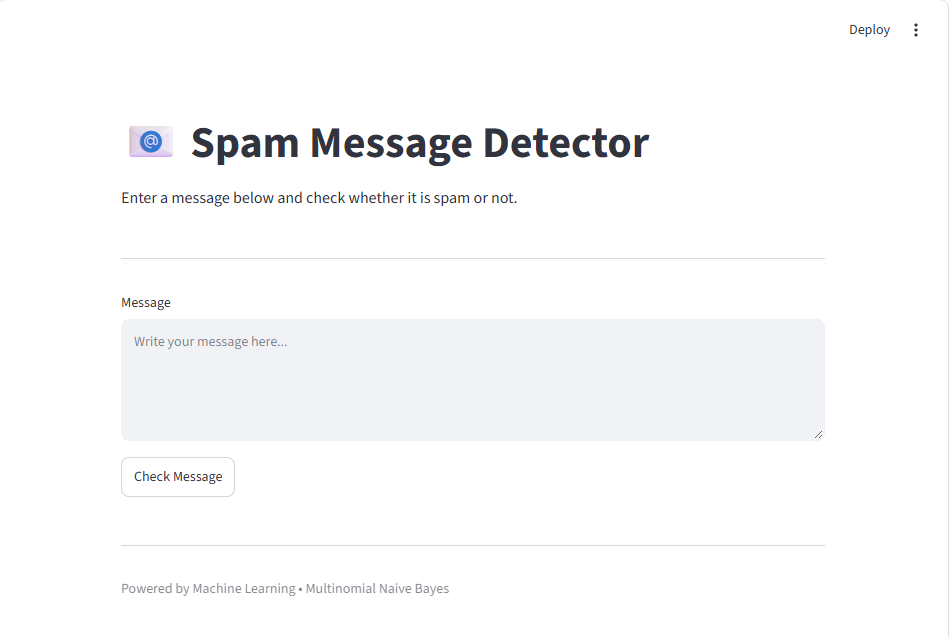
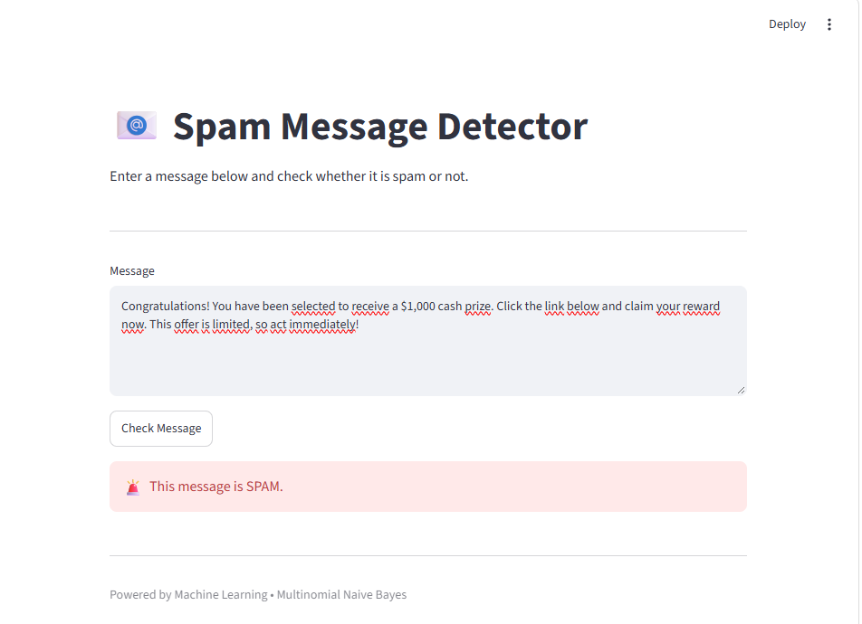
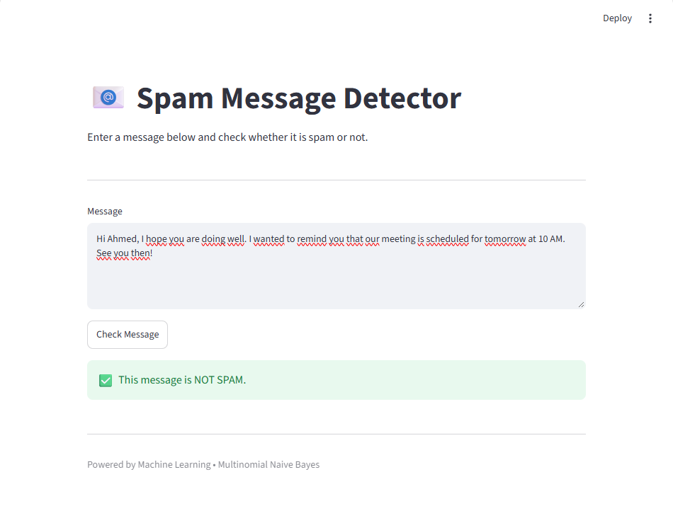

# 📧 Email Spam Detection Machine Learning Model

A simple machine learning application that detects whether a message is **Spam** or **Not Spam** using Python and Scikit-learn.

## 🖥️ Application

### Main Interface



### Spam Message Detection



### Not Spam Message Detection



## 🛠️ Technologies

* Python
* Pandas
* Scikit-learn
* Streamlit
* CountVectorizer
* Multinomial Naive Bayes

## ⚙️ How It Works

The application follows these steps:

1. Loads the spam message dataset.
2. Removes duplicate messages.
3. Splits the dataset into training and testing data.
4. Converts text messages into numerical features using `CountVectorizer`.
5. Trains a `MultinomialNB` machine learning model.
6. Takes a new message from the user.
7. Predicts whether the message is **Spam** or **Not Spam**.
8. Displays the result through a Streamlit web interface.

## 🚀 Installation

Clone the repository:

```bash
git clone https://github.com/GABSIWAEL/Email-Spam-Detection-Machine-Learning-Model.git
```

Go to the project folder:

```bash
cd Email-Spam-Detection-Machine-Learning-Model
```

Install the required dependencies:

```bash
pip install -r requirements.txt
```

## ▶️ Run the Application

Start the Streamlit application:

```bash
streamlit run SpamDetection.py
```

The application will open in your browser.

## 📊 Machine Learning Model

The project uses:

* **CountVectorizer** — converts text messages into numerical features.
* **Multinomial Naive Bayes** — classifies messages as Spam or Not Spam.
* **80/20 train-test split** — separates the dataset into training and testing data.

## 📁 Project Structure

```text
Email Spam Detection Machine Learning Model/
│
├── images/
│   ├── interface.png
│   ├── spam-result.png
│   └── not-spam-result.png
│
├── SpamDetection.py
├── spam.csv
├── requirements.txt
├── .gitignore
├── Commands.txt
└── README.md
```

## 👨‍💻 Author

**Wael Gabsi**

GitHub: GABSIWAEL
